# Aryan Sharma — Portfolio & Personal Site

A single‑page portfolio for a self‑taught high‑school quantitative researcher. It presents the
work, the **methodology** behind it, and — unusually — an explicit record of the ideas that
*failed*. It is built as a small, fast, accessible web application rather than a static résumé.

> **I build quantitative systems, understand markets, and want the technical and business
> training to scale that.**

**You can review the entire site below without running anything** — every section is captured as a
screenshot in [§ A guided tour](#a-guided-tour). The source is here too, if you'd like to read it.

| | |
|---|---|
| **Stack** | Next.js 16 (App Router) · React 19 · TypeScript (strict) · Tailwind CSS v4 · Motion |
| **Type** | Single‑page, statically generated, fully responsive (375 px → wide) |
| **Live site** | custom domain pending |
| **Honesty note** | All written content is real. The two interactive "lab" widgets are **clearly labelled as illustrative / simulated** — see [§ Intellectual honesty](#intellectual-honesty). |

---

## Contents

- [What this is](#what-this-is)
- [A guided tour](#a-guided-tour) — screenshots of every section
- [What's interactive](#whats-interactive)
- [Intellectual honesty](#intellectual-honesty)
- [Engineering highlights](#engineering-highlights)
- [Tech stack](#tech-stack)
- [Project structure](#project-structure)
- [Accessibility & performance](#accessibility--performance)
- [Run it locally](#run-it-locally)

---

## What this is

The site argues a single idea: *results are a by‑product of an honest process.* Every section
ladders up to that. The centrepiece is a research portfolio that leads with what **survived
scrutiny** and gives equal space to a **kill‑list** of rejected strategies — because, on a quant's
site, the discipline to throw work away is the real signal.

It is also a deliberate engineering artifact: hand‑built interactive components, a strict
no‑dependency‑bloat budget, a single motion language, and accessibility / reduced‑motion treated as
first‑class rather than bolted on.

---

## A guided tour

### 1 · Hero
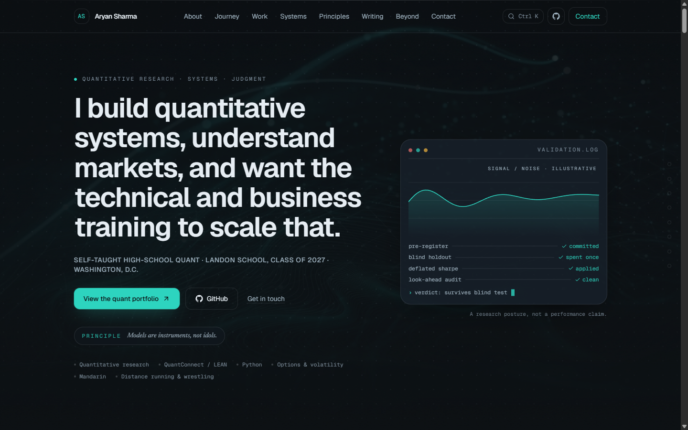

The throughline, primary calls to action, and a "research terminal" panel that animates the
*process* (an abstract signal converges; each validation step checks in one by one). The little
chart is labelled **"signal / noise · illustrative"** — it is a motif, not a performance claim.
Top‑right: a **⌘K** hint that opens a command palette.

### 2 · About — four operating pillars
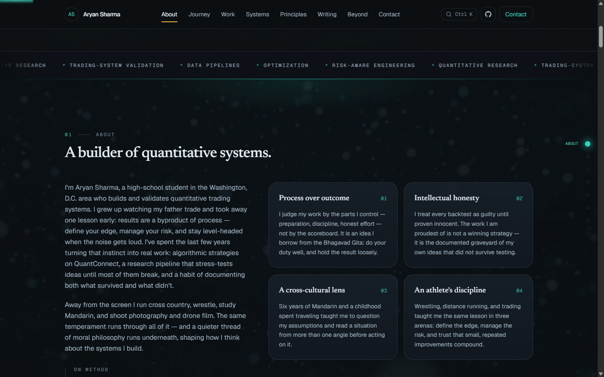

Process over outcome · intellectual honesty · a cross‑cultural lens · an athlete's discipline. Cards
lift and draw an accent border on hover; the bio slides in from the left as it enters view.

### 3 · The Journey (interactive carousel)
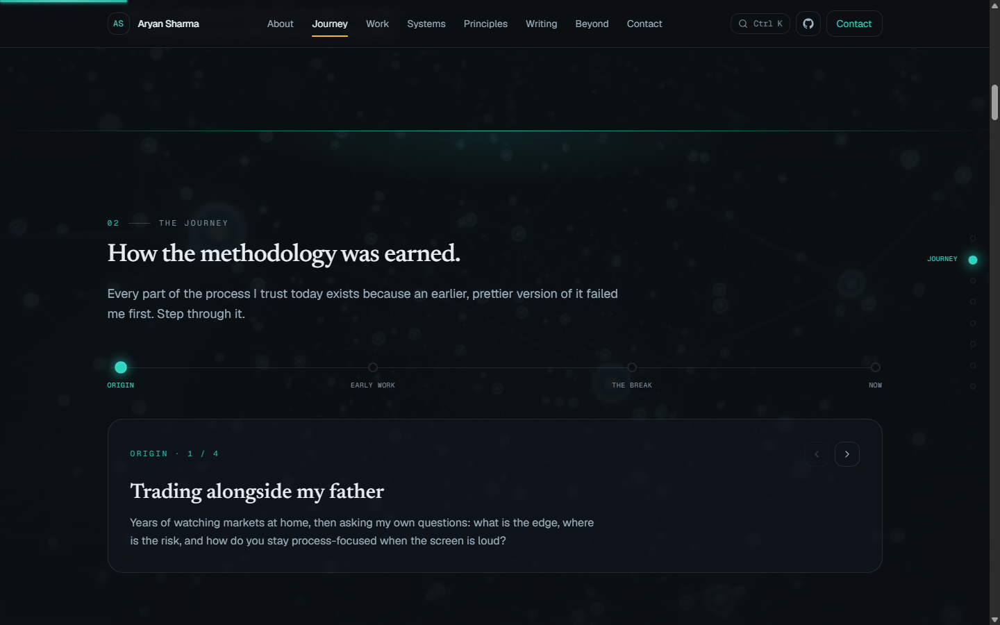

The path from TradingView/Pine Script experiments to a rigorous validation pipeline — rebuilt as a
**horizontal click‑through carousel** (stepper dots, prev/next, full keyboard support) instead of a
tall vertical timeline.

### 4 · Work — led by what survived
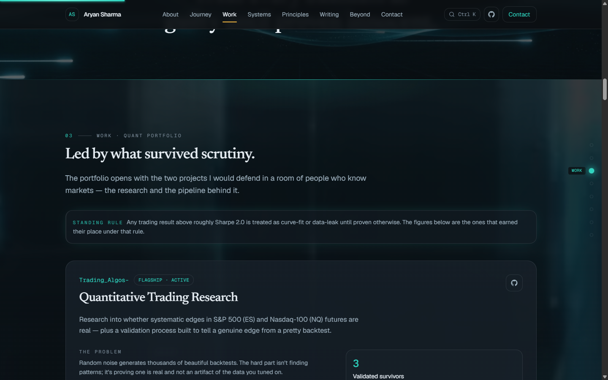

The portfolio opens with a **standing rule** (any Sharpe above ~2.0 is treated as curve‑fit until
proven otherwise) and the two flagship projects, each with problem → approach → evidence → **honest
limitations** and count‑up statistics.

### 5 · The seven‑part validation gauntlet (stateful tabs)
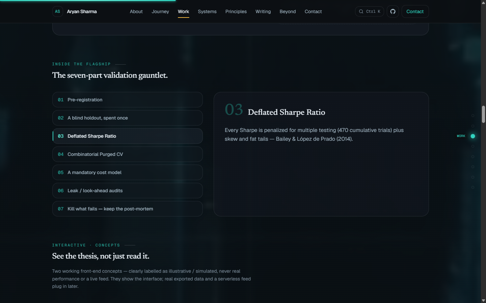

The methodology — pre‑registration, a blind holdout spent once, Deflated Sharpe, Combinatorial
Purged CV, a mandatory cost model, look‑ahead audits, and killing what fails — as an interactive
tablist. Click (or arrow‑key) a step on the left; the detail panel swaps on the right.

### 6 · Interactive concepts (honestly labelled)
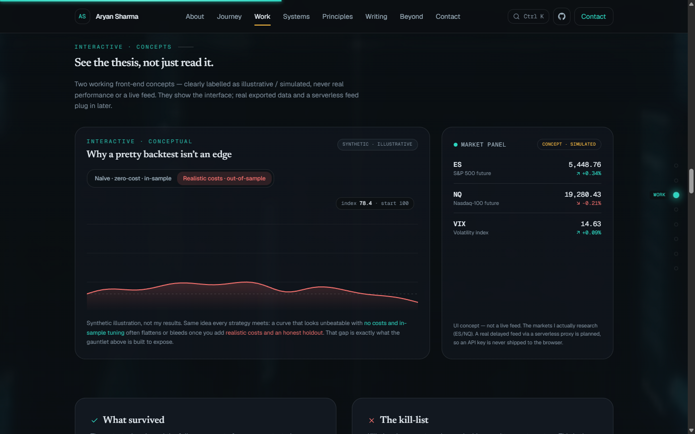

Two front‑end concepts that *demonstrate the thesis without faking data*:

- **A "playable" backtest** — toggle between a seductive zero‑cost / in‑sample curve and the same
  idea after realistic costs and an out‑of‑sample holdout (shown here in the latter, bleeding,
  state). Badged **"Synthetic · illustrative"** and captioned *"not my results."*
- **A market panel** — a streaming ticker UI badged **"Concept · simulated,"** stating plainly that
  it is *not a live feed* (a real delayed feed via a serverless proxy is planned, so an API key is
  never shipped to the browser).

### 7 · Survivors vs. the kill‑list
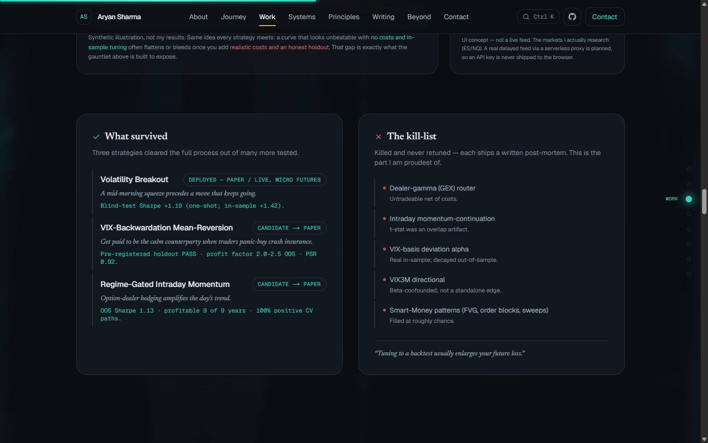

The two panels slide in from opposite sides. Survivors carry their real evidence; each killed idea
reveals a "post‑mortem" link on hover and tints red — the graveyard is presented as the proudest
artifact, not hidden.

### 8 · Systems & capabilities
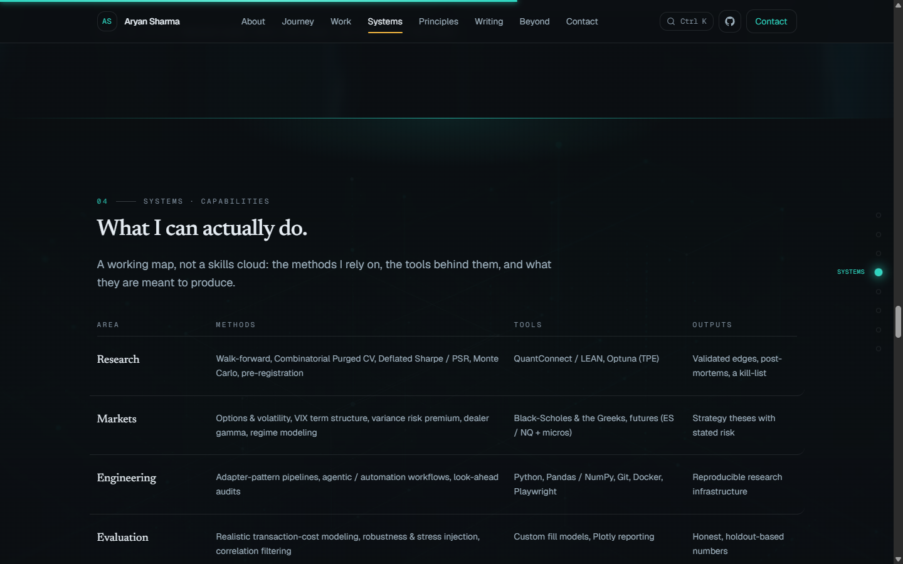

A working map (methods → tools → outputs), not a skills cloud. Rows highlight with an accent rail on
hover.

### 9 · Operating principles
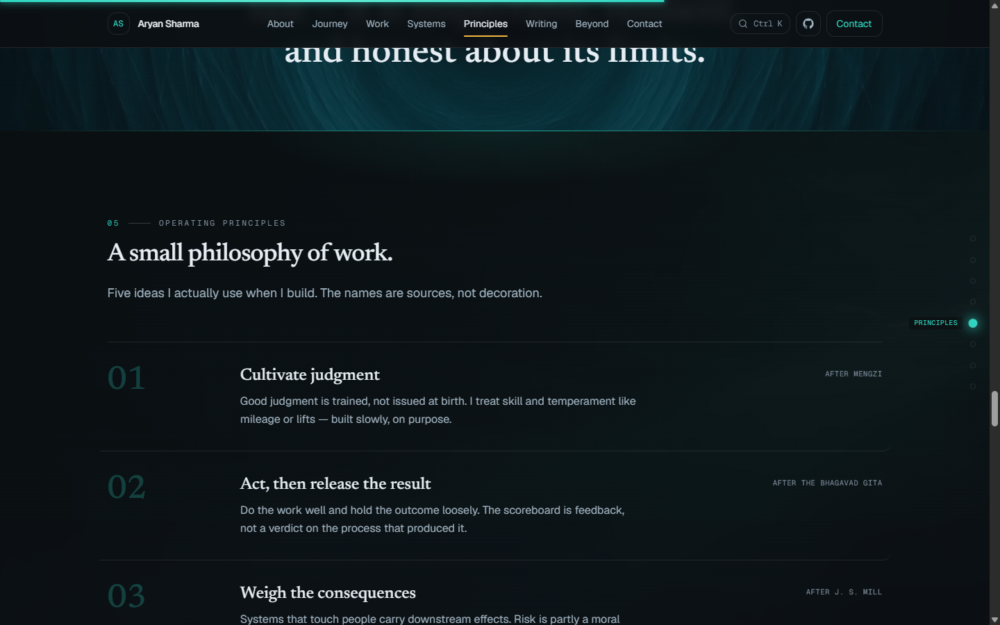

Five ideas actually used when building, with quiet "after …" source attributions that brighten on
hover. Editorial big‑number rows, deliberately not a card grid.

### 10 · Writing
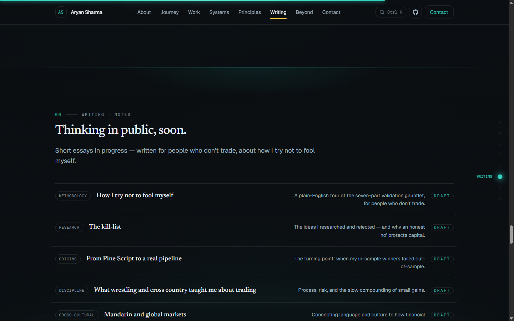

Seeded essay topics with pulsing "Draft" badges and row‑hover affordances.

### 11 · Beyond the screen
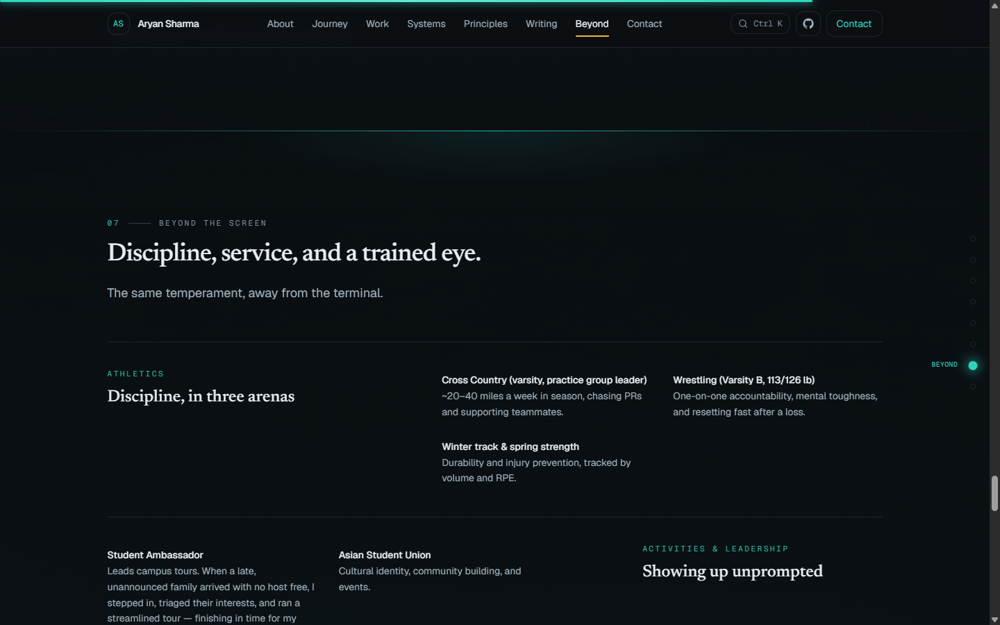

Athletics, activities, community, and creative work in alternating zig‑zag rows.

### 12 · What teachers say
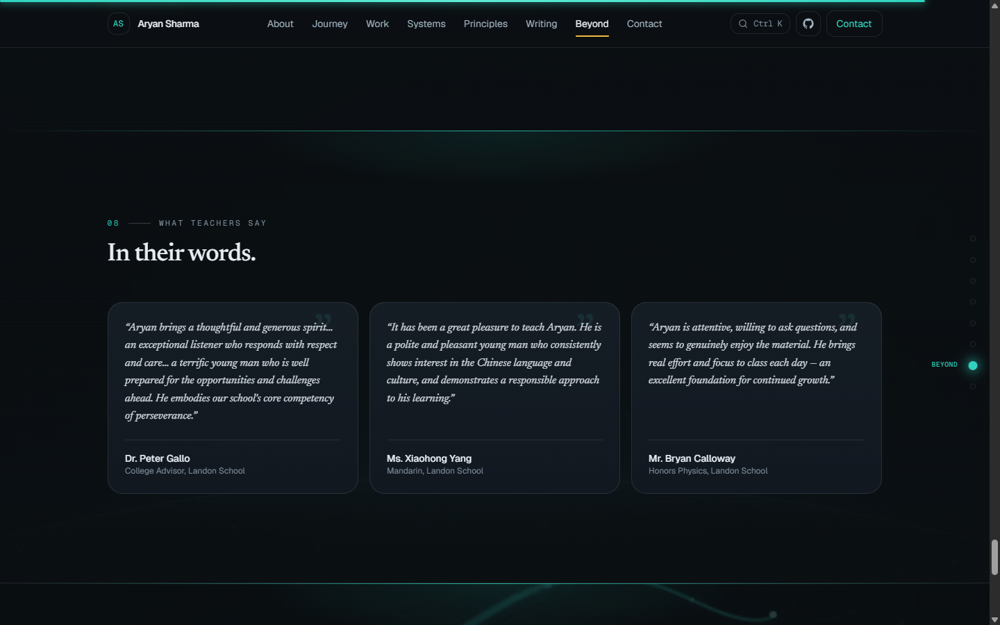

Lightly‑trimmed, grade‑free teacher comments as spotlight cards with a decorative quotation mark.

### 13 · Contact
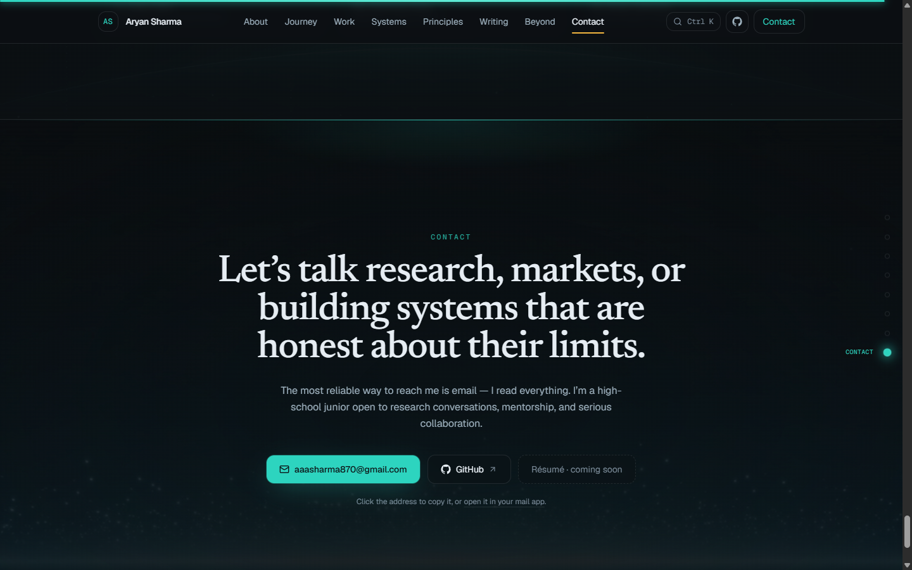

A full‑bleed finale with a **copy‑to‑clipboard** email button (with a "Copied!" confirmation) and a
mailto fallback.

### ⌘K · Command palette
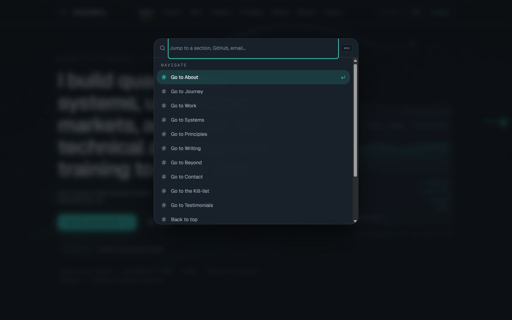

Press **⌘K / Ctrl K** anywhere (or the header hint) for a spotlight palette: jump to any section or
the kill‑list, open GitHub, email, or copy the address. Arrow keys, Enter, Esc, focus handling — the
gold standard from tools like Linear and Vercel, hand‑rolled with no extra dependency.

### Mobile
| Hero | Work |
|---|---|
| 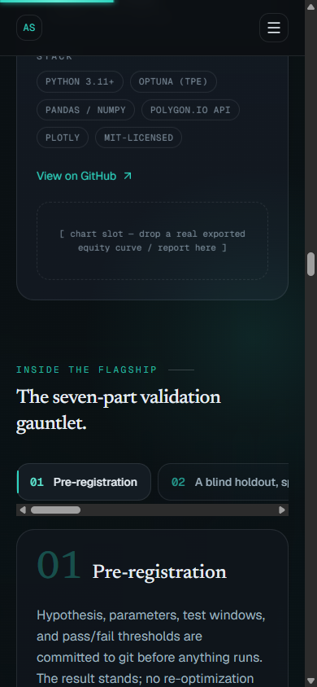 | 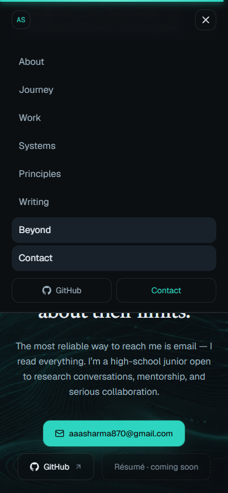 |

Single‑column layouts, no horizontal overflow, heavy background video disabled, the side rail hidden,
and animations that respect `prefers-reduced-motion`.

---

## What's interactive

| Feature | What it demonstrates |
|---|---|
| **⌘K command palette** | Global keyboard UX, fuzzy filtering, focus management, ARIA combobox/listbox |
| **Validation gauntlet tabs** | `useState`‑driven content swap, ARIA tablist + roving `tabindex`, animated indicator |
| **Journey carousel** | Stepper state, directional slide transitions, keyboard navigation |
| **"Playable" backtest** | Animated SVG path‑morph between two series, hover crosshair readout |
| **Concept market panel** | A streaming‑data UI pattern (clearly simulated), structured for a real feed later |
| **Scroll system** | Replaying scroll reveals, a velocity‑reactive edge glow, a section‑progress rail, and a reading‑progress bar |
| **Cursor & cards** | A pointer‑proximity dot lattice, spotlight + 3D‑tilt cards, magnetic buttons |

Everything animates **transform/opacity only**, and every effect has a real reduced‑motion fallback.

---

## Intellectual honesty

This is the value the whole site is built to signal, so it is enforced in the build:

- **No fabricated performance data.** The project "chart slot" is a clearly‑marked placeholder for a
  *real* exported equity curve, never an invented one. Any reported figure is framed with its caveats
  (e.g. the Option Alpha bots are presented as early **paper** trading with small‑sample,
  short‑volatility caveats — the spark that motivated the rigour, not a headline edge).
- **The interactive widgets are labelled.** The backtest chart says *"Synthetic · illustrative — not
  my results"*; the ticker says *"Concept · simulated — not a live feed."* They show the engineering
  without pretending to be real results or live markets.
- **Excluded by design.** No grades, scores, rank, or private personal data appear anywhere.

A pretty backtest is not an edge — and a portfolio that quietly invents one would undercut its own
argument. Labelling these as concepts is the point.

---

## Engineering highlights

- **One motion language.** A single ease‑out curve and a tight duration scale live in `lib/motion.ts`;
  no per‑component magic numbers, no `transition: all`, no animating layout properties.
- **A strict dependency budget.** The command palette, charts, carousel, dot‑grid, spotlight cards,
  and seamless video loops are all **hand‑built** rather than pulled from libraries — only `motion`
  and `lucide-react` earn their place.
- **Content is data.** All copy lives in a typed `lib/content.ts`, so the site stays editable and the
  honesty guardrails are enforced in one place.
- **Generative media, handled carefully.** Ambient background video is desktop‑only, mounted only
  while a section is in view, decoder‑capped, and loops seamlessly via a two‑copy cross‑fade — with
  optimized stills as posters everywhere else.

---

## Tech stack

- **Framework:** Next.js 16 (App Router, Turbopack), React 19, TypeScript (strict)
- **Styling:** Tailwind CSS v4 (`@theme` design tokens), a "Midnight Aqua" dark palette
- **Animation:** Motion (`motion/react`)
- **Icons / type:** `lucide-react`; `next/font` (Geist, Geist Mono, Newsreader)
- **SEO:** `next/og` OpenGraph image + favicon generated at build, `sitemap.ts`, `robots.ts`, JSON‑LD
- **Tooling:** ESLint (strict, incl. the React‑hooks rule set), fully type‑checked production build

---

## Project structure

```
app/                     # App Router: layout (fonts, metadata, JSON-LD, globals), page composition
  globals.css            # Design tokens + reusable utilities (Tailwind v4 @theme)
  opengraph-image.tsx    # Build-time OG image, icon, sitemap, robots
components/
  site/                  # One file per section (hero, about, journey, projects, …) + header/footer
                         #   command-palette, gauntlet-tabs, section-rail
  ui/                    # reveal, section, section-heading, tag, copy-email, icons, …
  visuals/               # dot-grid, spotlight-card, ambient-background, seamless-video,
                         #   scroll-progress, scroll-velocity, cursor-glow, quant-panel,
                         #   backtest-demo, concept-ticker
  providers/             # motion provider (global reduced-motion config)
lib/                     # content.ts (all copy), motion.ts (timing language), utils.ts
public/media/            # generative background stills + video loops
docs/screenshots/        # the images embedded in this README
```

Sections are server components; motion is isolated to small `"use client"` leaves.

---

## Accessibility & performance

- Semantic landmarks and an ordered heading outline (one `h1`, section `h2`s); a skip‑to‑content link.
- Keyboard support throughout: the command palette, gauntlet tabs, and journey carousel are all
  operable without a mouse, with visible focus rings and correct ARIA roles.
- `prefers-reduced-motion` is honoured everywhere — animations collapse to gentle opacity or static.
- WCAG‑AA contrast; hover is never the only affordance; decorative canvases are `aria-hidden`.
- Statically generated; `transform`/`opacity`‑only animation; lazy, in‑view‑gated, decoder‑capped
  video; `next/image`‑optimized stills. Clean production build, zero console errors, no layout overflow.

---

## Run it locally

```bash
npm install
npm run dev      # http://localhost:3000
npm run build    # production build (also type-checks)
npm run start    # serve the production build
npx eslint .     # lint
```

> Node 18+ recommended. The site is fully static — `npm run build` emits prerendered HTML.

---

<sub>Built and documented by Aryan Sharma. Content reflects real work; interactive lab widgets are
labelled illustrative/simulated by design.</sub>
